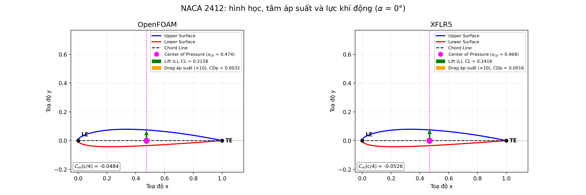
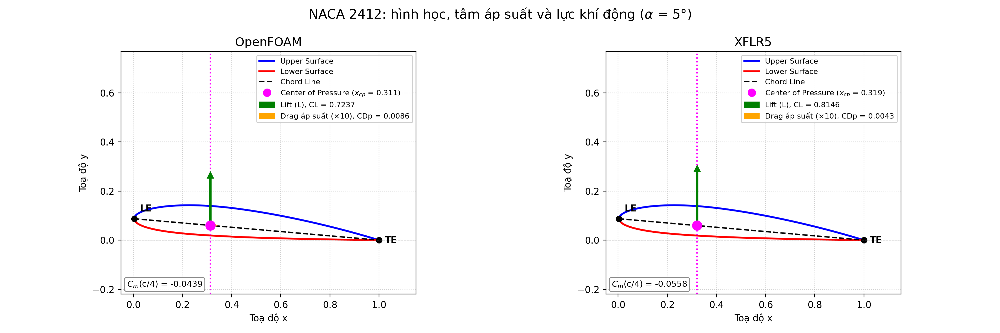
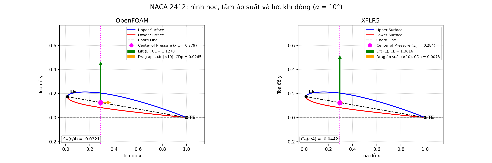
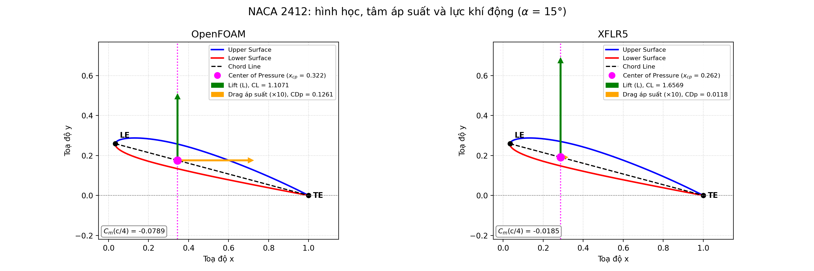
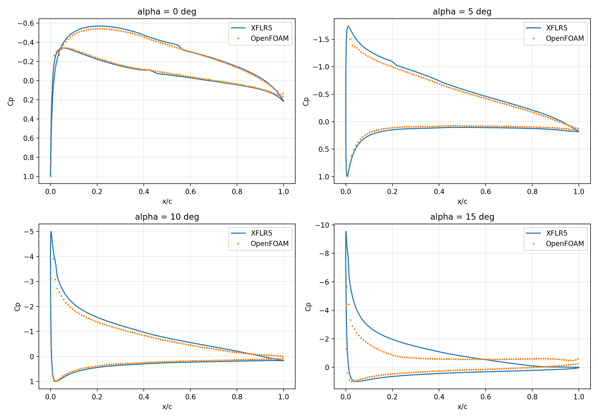

# Khảo sát khí động biên dạng NACA 2412: đối sánh XFLR5 và OpenFOAM
## Sinh viên thực hiện: Vũ Đức Lương
## Mã sinh viên 21021425

Báo cáo giữa kỳ. Thư mục này chứa toàn bộ code và hướng dẫn tái lập kết quả.
## 1. Mục tiêu

1. Xác định hệ số khí động (CL, CD, Cm), **tâm áp suất** (Xcp) và **tâm khí động** (Xac) của biên dạng NACA 2412 theo góc tấn α.
2. Đối sánh hai nguồn dữ liệu, **cùng một phép tích phân áp suất** (`cp_integration.py`) để chênh lệch chỉ đến từ nguồn Cp:
   - **XFLR5** (XFoil: dòng thế kết hợp lớp biên nhớt, có mô hình chuyển tiếp).
   - **OpenFOAM** (RANS, Spalart-Allmaras, rối hoàn toàn)
3. Dùng ảnh trường dòng (contour áp suất, vận tốc, streamline) để nhận xét hiện tượng **tách dòng** ở góc tấn lớn.

Điều kiện khảo sát: chord c = 1 m, vận tốc dòng tới |U| = 26 m/s, độ nhớt động học ν = 1×10⁻⁵ m²/s (đọc từ `constant/physicalProperties`; bản OpenFOAM dev không còn file `transportProperties`), suy ra **Re = 2,6×10⁶**. Góc tấn: 0°, 5°, 10°, 15°.

## 2. Cấu trúc thư mục

| File | Vai trò |
|---|---|
| `run_all.sh` | Chạy một lượt: lưới, case gốc, các góc tấn, so sánh |
| `setup_case.sh` | Tạo lưới cho NACA bất kỳ và dựng case gốc từ tutorial `airFoil2D` (xem 3.2 về điều kiện dòng tự do) |
| `make_naca_mesh.py` | Sinh biên dạng NACA 4 chữ số và lưới bằng Gmsh, xuất `naca.msh` |
| `run_cases.sh` | Với mỗi α: đổi hướng dòng tới, khai báo `forceCoeffs`, chạy solver |
| `cp_integration.py` | Thư viện: sinh hình học NACA, tích phân Cp trên contour kín, tính Xcp và Xac, đọc Cp của XFLR5 và đọc trực tiếp lưới + trường `p` của OpenFOAM |
| `compare.py` | Tích phân Cp của cả hai nguồn, đối chiếu với `forceCoeffs`, vẽ đồ thị, ghi CSV |
| `plot_forces.py` | Vẽ hình lực khí động theo từng góc tấn (biên dạng quay theo α, Xcp, vector lift và drag); ghi vào `hinh_luc/` |
| `xflr5_cp/` | File Cp xuất từ XFLR5 cho từng góc (`a0.txt`, `a5.txt`, `a10.txt`, `a15.txt`) |
| `hinh_luc/` | Sinh ra khi chạy `plot_forces.py`: `forces_a0.png`, `forces_a5.png`, `forces_a10.png`, `forces_a15.png` |
| `cases/` | Sinh ra khi chạy: case gốc `naca2412_base` và `af_a0`, `af_a5`, `af_a10`, `af_a15` |

## 3. Phương pháp và giải thích code

### 3.1 Hình học biên dạng và lưới (`make_naca_mesh.py`)

- **Hình học:** mã NACA 4 chữ số `MPTT` (2412) cho độ cong lớn nhất m = 2%, vị trí cong lớn nhất p = 40% dây cung, độ dày t = 12%. Đường camber và phân bố độ dày tính theo công thức chuẩn NACA, mỗi điểm được dịch vuông góc với đường camber. Hệ số cuối của phân bố độ dày dùng −0,1036 để **đuôi đóng kín**. Điểm phân bố theo cosine (60 điểm mỗi mặt) để vẽ spline biên dạng.
- **Miền tính:** hình tròn bán kính 20c tâm (0,5; 0), chia thành 4 cung. Hai cung phía trước là `inlet`, hai cung phía sau là `outlet`. Bounding box thực tế của lưới: x từ −19,5 đến 20,5, y từ −20 đến 20.
- **Lớp biên:** 25 lớp ô tứ giác, ô đầu tiên dày 3×10⁻⁴ m, tỉ lệ tăng 1,2. y⁺ **chưa được đo** **[kiểm tra]**: ước lượng thô theo Cf ≈ 0,003 cho y⁺ cỡ 10 đến 30, tức nằm ở vùng đệm của wall function chứ không chắc đã là 30.
- **Kích thước ô:** kích thước tối thiểu 0,01 gần biên dạng (field `Threshold`), tăng dần đến 2,0 ở biên xa. Lưu ý: kích thước 0,01 so với bán kính mũi cỡ 0,016c nghĩa là mũi chỉ có vài ô; chưa làm mịn riêng vùng mũi và đuôi.
- **Đùn 3D:** lưới 2D được kéo dày 0,1 theo z đúng một lớp ô (OpenFOAM luôn giải 3D). Hai mặt trước và sau được đặt là `empty` để bài toán thành 2D. Vì vậy diện tích tham chiếu **Aref = c × 0,1 = 0,1**.
- **Gán tên patch:** `inlet`, `outlet`, `walls` (biên dạng), `frontAndBack`. Tên khớp với các file điều kiện biên của tutorial.
- **Quy mô:** khoảng 25.000 ô (25.458 ô, hex ở vùng lớp biên, lăng trụ ở vùng ngoài), xuất `naca.msh` định dạng 2.2 để `gmshToFoam` đọc. `checkMesh`: độ không trực giao lớn nhất 40,6 (trung bình 3,7), skewness lớn nhất 15,9 với 11 mặt bị cảnh báo.

### 3.2 Thiết lập OpenFOAM (`setup_case.sh`, `run_cases.sh`)

- **Phiên bản:** OpenFOAM Foundation, nhánh `dev`. Solver là module `incompressibleFluid`, chạy bằng lệnh `foamRun` (thuật toán SIMPLE, bài toán dừng, **2000 vòng lặp**).
- **Case gốc:** sao chép tutorial `incompressibleFluid/airFoil2D`, thay lưới bằng lưới NACA 2412. Mô hình rối Spalart-Allmaras với biến `nuTilda`.
- **Điều kiện dòng tự do cho Spalart-Allmaras (đã sửa):** tutorial đặt `nuTilda = nut = 0,14` ở `internalField`, `inlet` và `outlet`. Với ν = 10⁻⁵ giá trị này lớn hơn khuyến nghị (ν̃ cỡ 3 đến 5 ν) hàng nghìn lần và làm lớp biên rối, dày ngay từ mép trước. Case hiện dùng:

  | Trường | Giá trị |
  |---|---|
  | `nuTilda` (`internalField`, `inlet`, `outlet`) | 4×10⁻⁵ (≈ 4ν) |
  | `nut` (`internalField`, `inlet`, `outlet`) | 6×10⁻⁶ (≈ ν̃·fv1) |

  Hai lệnh `sed` thay giá trị và lệnh `foamDictionary system/controlDict -entry endTime -set 2000` phải nằm trong `setup_case.sh` (ngay sau `cd "$NEW"`), vì script này xóa và dựng lại case gốc từ tutorial mỗi lần chạy. Nếu không, thiết lập sẽ bị ghi đè về giá trị cũ.
- **Điều kiện biên khác:** `inlet` và `outlet` kiểu `freestreamVelocity`/`freestream`, thành biên dạng `noSlip`, `nut` dùng `nutUSpaldingWallFunction`, `nuTilda` ở tường bằng 0.
- **Đổi góc tấn:** không xoay lưới mà xoay vector vận tốc dòng tới trong `0/U`: Ux = |U|cos α, Uy = |U|sin α.
- **Hệ số lực:** function `forceCoeffs` (thư viện `libforces.so`) chạy cùng solver trên patch `walls`:
  - `liftDir` = (−sin α, cos α, 0), `dragDir` = (cos α, sin α, 0) bám theo hướng dòng tới,
  - moment lấy quanh `CofR` = (0,25; 0; 0), tức **điểm 1/4 dây cung**, trục `pitchAxis` = (0, 0, 1),
  - `lRef` = 1, `Aref` = 0,1, `rhoInf` = 1 (áp suất trong solver là áp suất động học nên hệ số vẫn đúng).
- **Đầu ra:** `cases/af_aX/postProcessing/forceCoeffsDict/0/forceCoeffs.dat`, các cột `Time Cm Cd Cl Cl(f) Cl(r)`; script lấy dòng cuối.

### 3.3 Dữ liệu XFLR5

Biên dạng NACA 2412 tạo trong *Direct Foil Design*; phân tích trong *XFoil Direct Analysis* với polar Type 1, Re = 2,6×10⁶, Mach = 0, Ncrit = 9, chạy chế độ nhớt (Viscous bật). Với mỗi góc 0°, 5°, 10°, 15°, xuất phân bố Cp từ *Operating Point* thành `xflr5_cp/a0.txt`, `a5.txt`, `a10.txt`, `a15.txt` (cột `x, Cpi, Cpv`; code lấy cột Cpv). Tên file phải có dạng `a<góc>` để `alpha_from_name` đọc được.

XFoil không mô phỏng được vùng tách dòng lớn, nên ở α cao dữ liệu chỉ có giá trị tham khảo. Ở Re thấp XFoil cũng xử lý kém bong bóng tách lớp biên, nhưng ở Re = 2,6×10⁶ ảnh hưởng này nhỏ.

### 3.4 Xử lý số liệu (`cp_integration.py`, `compare.py`)

- **Tích phân áp suất:** contour kín được chia thành các cạnh; trên mỗi cạnh lực vi phân là dC = −Cp · n · ds, tích phân bằng cầu phương Gauss 2 điểm. Với XFLR5, Cp biến thiên tuyến tính giữa các nút (`cp_on="nodes"`); với OpenFOAM, Cp hằng số trên từng mặt lưới (`cp_on="edges"`). Lực trong trục dây cung (Cx, Cy) được quay sang trục gió để lấy CL và CDp. Chỉ có lực áp suất, **không có ma sát**, nên CDp nhỏ hơn CD tổng.
- **Cp của OpenFOAM:** `read_foam_wall_cp` đọc trực tiếp `points`, `faces`, `owner`, `boundary` và trường `p` ở bước thời gian cuối, nối các mặt `walls` thành contour kín và đổi sang Cp = p / (½|U|²).
- **Cp của XFLR5:** tách hai nhánh tại điểm x nhỏ nhất, nội suy lên contour NACA (mã NACA lấy từ `--code`).
- **Tâm áp suất:** Xcp/c = M_LE / Cy, tính từ mô-men quanh mép trước; bỏ khi |Cy| < 0,05 vì phép chia mất ý nghĩa.
- **Tâm khí động:** Xac/c = 0,25 − (dCm/dα) / (dCn/dα), hồi quy tuyến tính trên các góc α ≤ 10° (`amax`). Chỉ có 3 góc (0°, 5°, 10°) trong vùng này, và điểm 10° đã lệch tuyến tính trong OpenFOAM (xem 6.4).
- **Quy ước dấu:** Cm quanh c/4 theo quy ước hàng không (ngóc mũi dương, nose-down âm); mã tự đổi dấu từ mô-men z của OpenFOAM, không cần tùy chọn thủ công.
- **Đối chiếu nội bộ:** với OpenFOAM, `compare.py` so CL, Cm tích phân với `forceCoeffs.dat`. CDp được so với CD tổng và phải nhỏ hơn.
- **Tham số dòng lệnh:** `--code` (mã NACA, mặc định 2412), `--cases`, `--xflr5-dir`, `--xflr5-col`, `--umag` (mặc định 26), `--patch` (mặc định `walls`).
- **Đầu ra:** `so_sanh.png` (CL, Cm, Xcp, CDp theo α), `cp_so_sanh.png` (Cp theo x/c, hai nguồn chồng nhau), `ket_qua_tich_phan.csv`; Xac in ra màn hình.

### 3.5 Hình lực khí động (`plot_forces.py`)

- Dùng cùng dữ liệu và cùng phép tích phân Cp như `compare.py`; mỗi góc tấn một hình, mỗi hình có hai khung (OpenFOAM và XFLR5) với cùng thang trục để so sánh trực tiếp.
- **Hệ trục gió:** biên dạng NACA được quay thuận chiều kim đồng hồ góc α quanh mép sau, nên dòng tới nằm ngang (+x) và mũi cánh nâng lên đúng góc tấn.
- **Tâm áp suất:** đặt trên đường dây cung tại Xcp/c (tính từ mô-men quanh mép trước chia cho lực pháp tuyến Cy). Nếu |Cy| < 0,05 thì Xcp không xác định, hình vẽ tại c/4 và ghi chú rõ trong chú giải.
- **Lift:** mũi tên thẳng đứng (vuông góc dòng tới), dài `scale × CL` (mặc định `scale` = 0,3 chord).
- **Drag:** mũi tên nằm ngang (song song dòng tới), chiều dài `drag-gain × scale × CDp` với `drag-gain` mặc định 10, vì CDp nhỏ hơn CL cỡ 30 đến 100 lần. **Độ dài mũi tên drag không cùng tỉ lệ với lift**, chú giải ghi rõ hệ số phóng đại.
- **Chỉ có lực áp suất:** CDp không gồm ma sát. CDp của XFLR5 từ tích phân Cp kém tin cậy (xem mục 7), nên mũi tên drag của khung XFLR5 chỉ mang tính minh họa.

## 4. Cách chạy

```bash
pip install gmsh numpy matplotlib
bash run_all.sh                              # mặc định NACA 2412, góc 0 5 10 15
CODE=4412 ANGLES="0 4 8 12" bash run_all.sh  # đổi biên dạng hoặc góc
ANGLES="5" bash run_cases.sh                 # chạy riêng một góc
python3 compare.py --code 2412               # đứng ở thư mục gốc dự án
python3 plot_forces.py --code 2412           # hình lực khí động, ghi vào hinh_luc/
```

Lưu ý: `run_cases.sh` xóa và dựng lại `cases/af_a<góc>` từ `cases/naca<code>_base`, nên mọi chỉnh sửa phải làm ở case gốc (hoặc ở `setup_case.sh`), không làm trong `af_a<góc>`.

Hình trường dòng: `paraview cases/af_a10/case.foam`, chọn thời điểm cuối, tô màu theo `p` và `U`, dùng *Stream Tracer* hoặc tô màu theo `U_X` (vùng âm ở mặt hút là dòng hồi lưu).

## 5. Nguồn dữ liệu

| Dữ liệu | Nguồn |
|---|---|
| Hình học biên dạng | Công thức NACA 4 chữ số, tính trong `make_naca_mesh.py` và `cp_integration.py` |
| Hệ số CL, CD, Cm (OpenFOAM) | `forceCoeffs.dat` và tích phân Cp từ trường `p` |
| Hệ số CL, Cm, Xcp (XFLR5) | Tích phân Cp xuất từ XFLR5 (`xflr5_cp/`) |
| CD (XFLR5) | Polar XFLR5 **[điền]** (không dùng CDp tích phân, xem 7) |
| Trường áp suất, vận tốc, streamline | ParaView mở `cases/af_aX/case.foam` |
| Xcp, Xac | Tính bằng `compare.py` |
| Số liệu thực nghiệm tham chiếu | Abbott & von Doenhoff, *Theory of Wing Sections* **[điền: tra số liệu NACA 2412]** |
| Template case OpenFOAM | Tutorial `airFoil2D` đi kèm OpenFOAM |

## 6. Kết quả

### 6.1 Kiểm chứng phép tích phân (OpenFOAM)

CL và Cm tính bằng cách tích phân Cp từ trường `p` khớp với `forceCoeffs` của chính OpenFOAM đến 4 chữ số, ở cả 4 góc:

| α (°) | CL tích phân | CL forceCoeffs | Cm_c/4 tích phân | Cm_c/4 forceCoeffs |
|---|---|---|---|---|
| 0 | 0,2158 | 0,2159 | −0,0484 | −0,0481 |
| 5 | 0,7237 | 0,7238 | −0,0439 | −0,0436 |
| 10 | 1,1278 | 1,1281 | −0,0321 | −0,0318 |
| 15 | 1,1071 | 1,1076 | −0,0789 | −0,0788 |

Điều này xác nhận code đọc lưới, đổi p sang Cp và tích phân đúng. Nó **không** cho biết bản thân mô phỏng có chính xác không.

### 6.2 OpenFOAM (2000 vòng lặp, 1 lưới)

| α (°) | CL | CD (gồm ma sát) | CDp (chỉ áp suất) | Cm (c/4) | Xcp/c |
|---|---|---|---|---|---|
| 0 | 0,2159 | 0,0115 | 0,0032 | −0,0481 | 0,474 |
| 5 | 0,7238 | 0,0166 | 0,0086 | −0,0436 | 0,311 |
| 10 | 1,1281 | 0,0329 | 0,0265 | −0,0318 | 0,279 |
| 15 | 1,1076 | 0,1300 | 0,1261 | −0,0788 | 0,322 |

Hội tụ: ở 5°, CL thay đổi dưới 10⁻⁵ trong các bước cuối. Các góc còn lại **[kiểm tra]**: xem 200 bước cuối của `forceCoeffs.dat`, đặc biệt 10° và 15° (gần hoặc sau tách dòng, nghiệm dừng có thể dao động).

### 6.3 XFLR5 (tích phân Cp xuất từ Operating Point, Re = 2,6×10⁶)

| α (°) | CL | Cm (c/4) | Xcp/c |
|---|---|---|---|
| 0 | 0,2418 | −0,0526 | 0,468 |
| 5 | 0,8146 | −0,0558 | 0,319 |
| 10 | 1,3016 | −0,0442 | 0,284 |
| 15 | 1,6569 | −0,0185 | 0,262 |


### 6.4 Đối sánh

| α (°) | CL OpenFOAM | CL XFLR5 | OpenFOAM / XFLR5 |
|---|---|---|---|
| 0 | 0,2158 | 0,2418 | 0,89 |
| 5 | 0,7237 | 0,8146 | 0,89 |
| 10 | 1,1278 | 1,3016 | 0,87 |
| 15 | 1,1071 | 1,6569 | 0,67 |

Tâm khí động (hồi quy trên α ≤ 10°, 3 điểm): Xac/c = **0,232** (OpenFOAM) và **0,242** (XFLR5).

| Nội dung | XFLR5 | OpenFOAM |
|---|---|---|
| Phân bố áp suất | Đồ thị Cp theo x/c (`cp_so_sanh.png`)  | Contour áp suất tại 0°, 5°, 10°, 15° |
| Tâm áp suất Xcp | 0,468 → 0,319 → 0,284 → 0,262 | 0,474 → 0,311 → 0,279 → 0,322 |
| Tâm khí động Xac | 0,242c | 0,232c |
| Tách dòng | Chỉ gián tiếp: không thấy stall đến 15° | CL rớt ở 15° (1,108 so với 1,128 ở 10°), CDp tăng vọt **[hình streamline, nhất là 10° và 15°]** |

### 6.5 Hình minh họa

Các hình dưới đây cần được chèn sau khi chạy lại code với số liệu cuối cùng. Thay các dòng **[chèn hình]** bằng ảnh thật.

#### 6.5.1 Lực khí động và tâm áp suất theo góc tấn

Sinh bằng `python3 plot_forces.py --code 2412`. Mỗi hình có khung trái là OpenFOAM, khung phải là XFLR5.

| Góc tấn | Hình |
|---|---|
| 0° |  |
| 5° |  |
| 10° |  |
| 15° |  |

Chú thích dùng cho báo cáo: mũi tên xanh là lift, mũi tên cam là drag do áp suất (phóng đại ×10 so với lift), chấm tím là tâm áp suất trên dây cung. Xcp dịch về phía mũi khi α tăng; ở 15° OpenFOAM cho Xcp tăng lại do stall. **[điền: nhận xét sau khi xem hình thật]**

#### 6.5.2 Phân bố Cp theo x/c

- `cp_so_sanh.png` (sinh bởi `compare.py`): Cp của XFLR5 và OpenFOAM chồng nhau tại từng góc. 

  

#### 6.5.3 Trường dòng từ ParaView (OpenFOAM)

Mở `cases/af_aX/case.foam`, chọn bước cuối (2000), nhìn theo trục z, dùng cùng thang màu cho cả bốn góc.

| Nội dung | 0° | 5° | 10° | 15° |
|---|---|---|---|---|
| Contour áp suất `p` | **[chèn hình]** | **[chèn hình]** | |   |
| Vận tốc `U` (magnitude) | **[chèn hình]** | **[chèn hình]** | **[chèn hình]** | **[chèn hình]** |
| Vorticity theo z  | **[chèn hình]** | **[chèn hình]** | **[chèn hình]** | **[chèn hình]** |
| Streamline và vùng hồi lưu (`Uwind` < 0) | | | **[chèn hình]** | **[chèn hình]** |

Lưu ý: case là 2D dừng (SIMPLE), nên chỉ quan sát được lớp biên, vùng cắt và vùng hồi lưu trung bình. Không có xoáy đầu cánh (tip vortex) hay xoáy bong chu kỳ.

## 7. Nhận xét và kết luận

1. **Tâm khí động:** cả hai nguồn cho Xac gần 0,25c như lý thuyết biên dạng mỏng (0,232 và 0,242). Với OpenFOAM, điểm 10° đã ra khỏi vùng tuyến tính (độ dốc CL 5° đến 10° chỉ 0,081 mỗi độ, so với 0,102 mỗi độ trong 0° đến 5°) nên Xac 0,232 bị kéo lệch. Cần thêm các góc 2°, 4°, 6°, 8° để hồi quy chỉ trong vùng tuyến tính.
2. **Tâm áp suất:** Xcp dịch dần về phía mũi khi α tăng (từ khoảng 0,47 về 0,28 đến 0,26 ở 10° đến 15° trong XFLR5; OpenFOAM tăng lại ở 15° do stall), đúng quy luật của biên dạng có camber.
3. **Đường CL–α:** hai nguồn lệch nhau khoảng 11 đến 13% ở α ≤ 10° (OpenFOAM thấp hơn), độ dốc đầu là 0,102 mỗi độ (OpenFOAM) và 0,115 mỗi độ (XFLR5) trong 0° đến 5°. Hai nguồn **khác nhau về mô hình** (SA rối hoàn toàn so với XFoil có chuyển tiếp), nên chênh lệch chưa nói được bên nào gần thực tế hơn. Cần đối chiếu với số liệu thực nghiệm NACA 2412 **[điền]**.
4. **Tách dòng:** OpenFOAM cho dấu hiệu stall sớm hơn rõ rệt (CL rớt ở 15°, CDp 0,126), trong khi XFLR5 vẫn tăng CL đến 1,66. Spalart-Allmaras dừng thường dự đoán tách dòng sớm, và XFoil thường dự đoán CLmax cao, nên chênh lệch lớn ở 15° không được xem là đã giải thích. Cần ảnh streamline **[chèn hình]**.
5. **CDp của XFLR5** (từ tích phân Cp) không đáng tin: nó là hiệu của các số lớn gần triệt tiêu và rất nhạy với số panel. Chỉ so sánh CD tổng (polar XFLR5, `forceCoeffs` OpenFOAM), không so CDp XFLR5 với OpenFOAM.
6. **Kết luận chung:** phép tích phân Cp được kiểm chứng nội bộ (mục 6.1). Hai mô hình cho xu hướng vật lý giống nhau ở α ≤ 10° (CL tuyến tính, Cm_c/4 ≈ −0,04 đến −0,05, Xac gần 0,25c) và khác nhau rõ ở vùng tiến tới tách dòng. Kết quả OpenFOAM mới là của **một lưới** chưa kiểm định độc lập lưới và chưa có y⁺ thực đo, nên chỉ nên dùng để nhận xét xu hướng và hiện tượng, chưa dùng làm số liệu định lượng tuyệt đối.

## 8. Hạn chế và hướng phát triển

- **Đã xử lý:** CD của OpenFOAM từng cao bất thường (0,0238 ở 0°, 0,0365 ở 5°) và CL thấp (0,6724 ở 5°). Nguyên nhân chính là `nuTilda`, `nut` ở dòng tự do lấy nguyên 0,14 từ tutorial. Sau khi sửa (mục 3.2) và tăng lên 2000 vòng lặp, CD giảm còn 0,0115 ở 0° và 0,0166 ở 5°, CL(5°) tăng từ 0,6724 lên 0,7238. Hai kết quả này **không** loại trừ nguyên nhân khác: khoảng cách còn lại tới XFLR5 chưa được giải thích.
- **Chưa làm:** kiểm định độc lập lưới (cần ít nhất hai lưới); làm mịn vùng mũi và đuôi (hiện bước ô 0,01, bán kính mũi cỡ 0,016c); đo y⁺ thực tế (lệnh `foamPostProcess -solver incompressibleFluid -func yPlus -latestTime`, chưa chạy thành công trên bản dev đang dùng); xác định vị trí 11 mặt skew 15,9; kiểm tra hội tụ ở 10° và 15°.
- **Chưa đối chiếu thực nghiệm:** hiện chỉ có hai mô hình số so với nhau. Cần số liệu thực nghiệm NACA 2412 làm tham chiếu thứ ba.
- Mô hình rối Spalart-Allmaras không dự đoán chính xác CLmax và vùng tách dòng; có thể thử k-ω SST.
- XFLR5 giả thiết dòng gần dính, không áp dụng tin cậy sau góc tách.
- Hướng làm tiếp cuối kỳ: kiểm định độc lập lưới, thêm các góc 2°, 4°, 6°, 8° để fit Xac trong vùng tuyến tính và các góc 12° đến 18° quanh tách dòng, kiểm thử trên NACA 0012, so sánh với số liệu thực nghiệm công bố.

## 9. Tài liệu tham khảo

1. I. H. Abbott, A. E. von Doenhoff, *Theory of Wing Sections*, Dover, 1959 (công thức NACA 4 chữ số và số liệu thực nghiệm).
2. M. Drela, "XFOIL: An Analysis and Design System for Low Reynolds Number Airfoils", 1989; tài liệu XFLR5.
3. OpenFOAM Foundation, *OpenFOAM User Guide* và tutorial `incompressibleFluid/airFoil2D`, openfoam.org.
4. C. Geuzaine, J.-F. Remacle, "Gmsh: a three-dimensional finite element mesh generator", 2009; tài liệu tại gmsh.info.
5. P. R. Spalart, S. R. Allmaras, "A one-equation turbulence model for aerodynamic flows", 1992.

*Ghi chú:* các script được xây dựng với sự hỗ trợ của công cụ AI (Claude); người thực hiện đã chạy, kiểm tra và chịu trách nhiệm về kết quả. 
